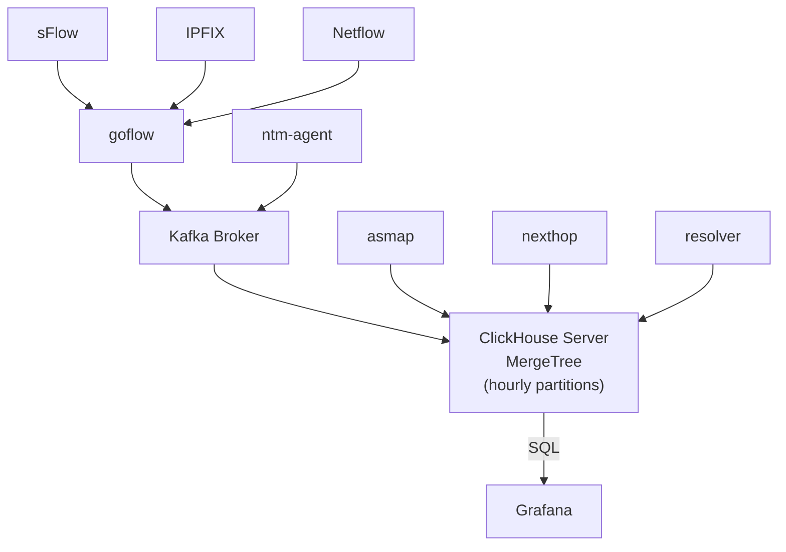

# NetMeta

    
    
    
    

| ⚠️         **PRE-RELEASE**: This is a work in progress - please watch this repo for news. |
|-------------------------------------------------------------------------------------------|

NetMeta is a scalable network observability toolkit optimized for performance.

Flows are not pre-aggregated and stored with one second resolution. This allows for
queries in arbitrary dimensions with high-fidelity graphs.

## ⚡️ Features

NetMeta captures, aggregates and analyzes events from a variety of data sources:

* sFlow
* NetFlow/IPFIX
* Port Mirror
* Linux NFLOG (soon)
* Linux conntrack (soon)
* Web server logs (soon)
* Scamper traces (soon)
* GCP VPC Flow Logs (soon)
* AWS VPC Flow Logs (soon)

The different pros/cons between these and a more informations about the ingest of events can be found [here](doc/ingest.md)

NetMeta also allows to integrate FastNetMon Attack notifications on the Dashboards.
The docs to setup this and other Grafana related settings can be found [here](doc/grafana.md)

Sampling rate is detected automatically. Different devices with different sampling rates can be mixed.
IPv6 is fully supported throughout the stack.

## 👀 Demo

## 💥 API Stability

NetMeta is **alpha software** and subject to change. It exposes the following APIs:

* The cluster configuration file for single-node deployments.
* ClickHouse SQL schema for raw database access.
* Protobuf schemas for ingestion for writing custom processors.

One NetMeta has stabilized, these APIs will be stable and backwards compatible.

## 🛠 Deployment
### [Single-node deployment](doc/single-node-deployment.md)

NetMeta includes a production-ready single node deployment that scales to up to ~100k events/s and billions of database
rows. More infos can be found [here](doc/single-node-deployment.md)

Ingestion performance is limited by CPU performance and disk bandwidth.
Query performance is limited by disk and memory bandwidth, as well as total amount of available memory for larger
in-memory aggregations.

Most reads/writes are sequential due to heavy use of batching in all parts of the stack,
and it works fine even on network storage or spinning disks. We recommend local NVMe drives for best performance.

NetMeta can scale to millions of events per seconds in multi-node deployments.

### Multi-node deployment

Work In Progress. Please contact us if you're interested in large-scale deployments.

### Monogon Metropolis

Stay tuned - NetMeta will be a first-class citizen on Monogon's [Metropolis](https://monogon.tech/metropolis.html)
cluster operating system.

### ☸️ Kubernetes

NetMeta works on any Kubernetes cluster that supports LoadBalancer and Ingress objects and can provision storage.
It's up to you to carefully read the deployment code and cluster role assigments to make sure it works with your
cluster.
Note that we use two operators, which require cluster-admin permissions since CRDs are global
([Strimzi](https://strimzi.io/docs/master) for Kafka
and [clickhouse-operator](https://github.com/Altinity/clickhouse-operator)).

All pieces of NetMeta are installed into a single namespace. By default, this is ``default``, which is probably not what
you want.
You can change the target namespace in the deployment config.

Please contact us if you need help porting NetMeta to an existing k8s cluster.

## 🧩 Related

NetMeta is powered by a number of great open source projects, we use:

- [ClickHouse](https://clickhouse.tech) as the main database
- [Kafka](https://kafka.apache.org) as a queue in front of ClickHouse
- [Grafana](https://grafana.com/) with
- [clickhouse-grafana](https://github.com/Vertamedia/clickhouse-grafana) as frontend
- [goflow](https://github.com/cloudflare/goflow) as the sFlow/Netflow collector
- [Strimzi](https://strimzi.io/) to deploy Kafka,
- [clickhouse-operator](https://github.com/Altinity/clickhouse-operator) to deploy ClickHouse, as well as
- [Kubernetes](https://kubernetes.io/) and Rancher's [k3s](https://k3s.io/).

## 🏰 Architecture

---

(C) 2021 [Monogon SE](https://monogon.tech).

This software is provided "as-is" and
without any express or implied warranties, including, without limitation, the implied warranties of
merchantability and fitness for a particular purpose.
